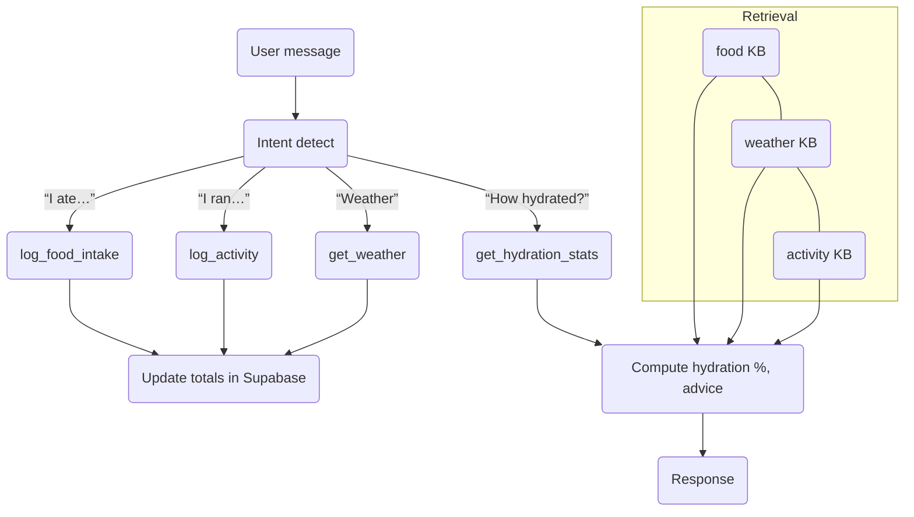

# HYDRATION & OSMOLE CHEAT‑SHEET  (Clinician + Builder edition)

> “Track **particles**, not just **calories**.”

---

## 1 Core Definitions

### Key Formulas
- **Osmole Score:** `osmole_score = sugar_g + protein_g*10 + (sodium_mg/23)`
- **Sweat Rate (L/h):** `sweat_rate_lh = base_rate(activity,intensity) × weather_factor(temp,humidity)`
- **Sodium Loss (mg):** `sodium_loss_mg = sweat_rate_lh × Na_loss_per_L × duration_h`
- **Percent Hydrated:** `percent_hydrated = fluids_in_ml / fluids_need_ml`

| Term | 1‑sentence meaning | In the app |
|------|--------------------|-----------|
| **Osmole** | Count of dissolved particles that pull water across membranes. | Drives “ballast” math—how much fluid your body must shift. |
| **Sweat‑rate** | Litres of water lost per hour via skin. | Weather × activity table → predicts losses. |
| **Na⁺ / K⁺ losses** | Salt mass lost with sweat (mg per hour). | Determines electrolyte target; logged food bridges the gap. |
| **Hydration % of need** | Fluids‑in ÷ fluids‑required so far today. | Status badge shown to user. |

---

## 2 High‑level Flow

---

## 3 Rules of Thumb (hard‑coded for mini LLM)

---

## AI Guidance
- Use the formulas above for all hydration and food log calculations.
- When asked for “hydration needs”, use `percent_hydrated = fluids_in_ml / fluids_need_ml`.
- Always prefer canonical fields from `body_composition_logs` for `weight_kg`, `body_fat_pct`.
- For food or drink impact, always compute `osmole_score`.
- Use `sweat_rate_lh` and `sodium_loss_mg` for activity-based hydration planning.

| If… | Then advise… |
|-----|--------------|
| **Weight –2 %** in <24 h | “Drink 150 % of weight lost over next 2 h ▶︎ ORS or salty soup.” |
| **Urine colour ≥6** | “You’re concentrated; sip 500 mL now, re‑check in 1 h.” |
| **Sweat‑rate × duration > 2 L** AND Na loss > 2 g | “Add high‑Na ORS (1.5 g/L) + salty snack.” |
| **Osmole load meal > 400** (e.g. dates, protein bar) | “Pair with at least 250 mL water.” |

---

## 4 Why “osmole > calorie” for hydration

* **Calories** tell energy but ignore salt & urea.  
* **Osmole score** ≈ (g protein × 10) + (g sugar) + (Na mg ÷ 23).  
* Body must keep ECF ~285 mOsm/kg; excess osmoles pull water from cells → *dehydration even while drinking*.  

Example: 3 Medjool dates (75 g sugar) ⇒ ~400 osmoles; needs ~300 mL extra water to keep serum unchanged.

---

## 5 Quick Tables

### 5.1 Weather → Loss multipliers

| Class | Multiplier on sweat table |
|-------|---------------------------|
| Cool | × 0.8 |
| Warm | × 1.0 |
| Hot  | × 1.5 |
| Extreme | × 2.0 |

### 5.2 Activity baseline (22 °C)

| Activity‑Intensity | L/h | Na mg/h |
|--------------------|-----|---------|
| Walk‑Low | 0.2 | 100 |
| Walk‑Mod | 0.5 | 400 |
| Run‑High | 1.5 | 1500 |
| HIIT‑Extreme | 1.5 | 1500 |

*(multiply by weather factor)*

---

## 6 Typical Dialogue Patterns

> **User:** “Had 2 protein bars, any water?”  
> **Assistant:**  
> • *log_food_intake* → osmole ≈ 190 × 2 = 380.  
> • Reply: “Those bars add ~380 osmoles; sip ~300 mL water to balance.”

> **User:** “Did 30 min high HIIT in 40 °C.”  
> • *log_activity* + *get_weather*  
> • Sweat loss ≈ 0.75 L, Na ≈ 750 mg  
> • Response: “Drink ~1 L water + sports drink (≥1 g/L Na) within 1 h.”

---

## 7 Builder Reminders

1. **Assistant temp = 0.2**, top‑p = 1.0.  
2. Tool schemas only allow: `type, enum, description, properties, required`.  
3. Retrieval files auto‑vectorised; Supabase rows via tools.  
4. Gold‑tests live in `/tests/gold_prompts.yaml`.  
5. CI fails if any “must_contain” missing → safe deploys.

---

*End of cheat‑sheet.*